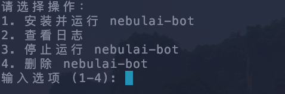

# nebulai-bot
该项目实现了[nebulai](https://nebulai.network/opencompute?invite_by=7BPKiD)项目的自动挂机功能。

**更多脚本分享, 关注我的[X](https://x.com/0Xiaofan22921)**

## 预览

## 功能

+ 只需第一次运行脚本时使用邮箱验证码登录，之后无需额外操作
+ 自动计算任务并提交
+ 24小时到期之后自动更新，无需在网页上点击

## 运行要求

+ nodejs环境

## 使用方法

一键脚本, 在终端里执行以下脚本即可:
```
wget -O nebulai-bot.sh https://raw.githubusercontent.com/fcmfcm1999/nebulai-bot/refs/heads/main/nebulai-bot.sh && sed -i 's/\r//' nebulai-bot.sh && chmod +x nebulai-bot.sh && ./nebulai-bot.sh
```

## 注意事项

+ nebulai的任务涉及到大矩阵计算, 会占用大量cpu资源
+ 每提交成功十次任务才会去查询分数, 如果不显示分数, 等待一会就好
+ 本脚本涉及到的网络请求只跟nebulai相关, 欢迎review代码

## 免责声明

本项目仅供学习研究使用，使用本项目产生的任何风险由使用者自行承担。 

